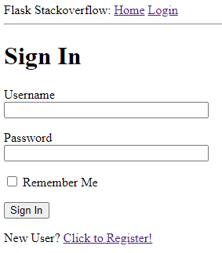
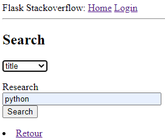
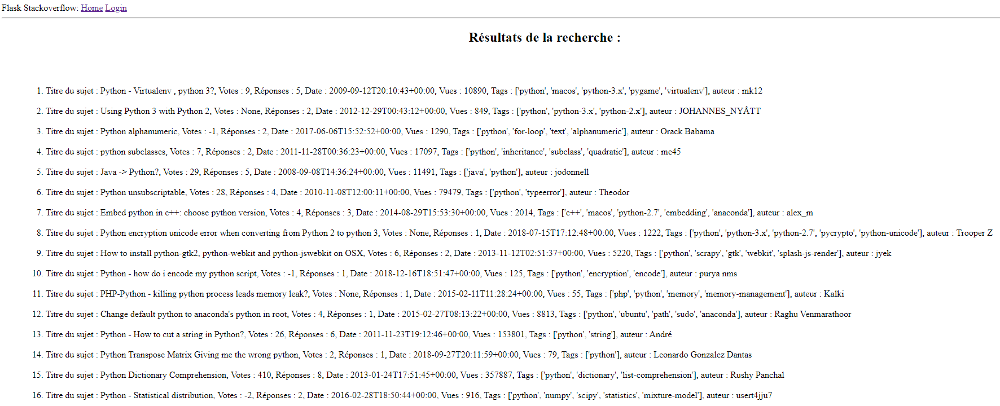
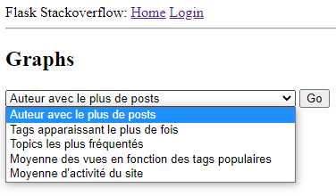
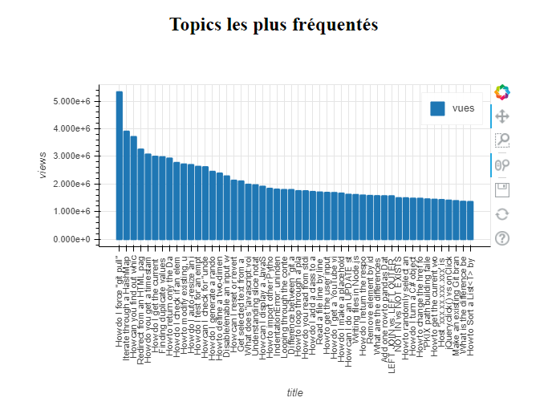

================================================================================
**PROJET DATA-ENGINEERING : Application Flask sur les données de StackOverflow**
================================================================================

Notre projet consiste à scrapper le site Stack Overflow et à en récupérer les questions posée en sauvegardant leur titre, le nombre de votes, le nombre de réponse, la date à laquelle la question a été posée ainsi que l'auteur de la question, le nombre de vues et les tags de la question.
Ces informations seront ensuite stockées dans une base ElasticSearch qui sera accessible via notre application flask au moyen de requêtes.

Pour lancer le projet, montez l'image docker fournie et lancer les containers. Il faut ensuite activer l'environnement dans lequel s'exécute flask, pour se faire placez-vous dans le dossier flask_app puis faites la commande : ``venv\Scripts\activate.bat``. Ensuite pour lancer l'application Flask, exécuter la commande ``flask run``. Si celle-ci ne fonctionne pas, vous pouvez exécuter le fichier run.py .

---------------------------
**Fonctionnalités du site**
---------------------------

Le site Flask offre plusieurs fonctionnalités : vous pouvez créer un compte utilisateur et vous connectez (pour des raison de practicités le fait d'être identifié n'apporte aucun avantage sur l'application mais ceci est rapidement paramétrable). 

La première fonctionnalité utilisant les données est une fonction de recherche permettant de rechercher un élément dans le champ choisi dans le menu déroulant. On peut sélectionner sur quelle variable chercher, donc on peut chercher un mot d'un titre de topic, ou un auteur particulier, ou par rapport aux nombre de vues. On appuie ensuite sur le bouton Go pour afficher les premiers résultats liés à notre requête.

...............

La seconde permet d'afficher des statistiques sur le site comme les utilisateurs posant le plus de questions, les tags les plus recherchés (et donc les langages de programmation les plus populaires), ou encore les heures avec le plus d'activité sur le site. Après avoir fait notre choix, l'application affiche alors un graphe dont on peut lire les données en déplaçant le curseur sur le graphe.

...............

Les données sont stockées dans une base de données ElasticSearch et sont utilisées dans le site grâce à divers requêtes. Une fois les requêtes exécutées avec la fonction search de l'objet ElasticSearch, les données sont récupérées dans des dataframes Pandas pour être affichées (après avoir été éventuellement traitées) grâce à un plot. Actuellement, toutes les données proviennent de la base ElasticSearch exception faites des données sur l'activité horaire du site. Ces données devant être récupérées dans toute la base, nous avions besoin d'utiliser des fonctions d'aggrégations dans nos requêtes, fonctions que nous n'avons pas réussi à mettre en place à cause de conflit de type du champ Elastic contenant les dates. Le graphique montrant l'activité horaire est donc obtenu directement à partir des données stockées dans le json issu du parsing.

---------------------------
**Parsing de StackOverflow**
---------------------------

Ces données ont été obtenues grâce à une spider scrapy nommée stack. Cette spider parse tout le site StackOverflow en obtenant tout d'abord le nombre de pages totales du site, puis parse chaque page individuellement afin d'extraire le titre de chaque question ainsi que leur auteur, la date à laquelle la question a été postée, ainsi que le nombre de vues et de votes pour la question. Ces informations sont scrappées et stockées dans un fichier nommé data.json trouvable dans le dossier scrapy_project. La spider utilise une rotation de user agent ainsi qu'un changement automatique de proxy afin de pouvoir scrapper tout le site sans être bloqué.
